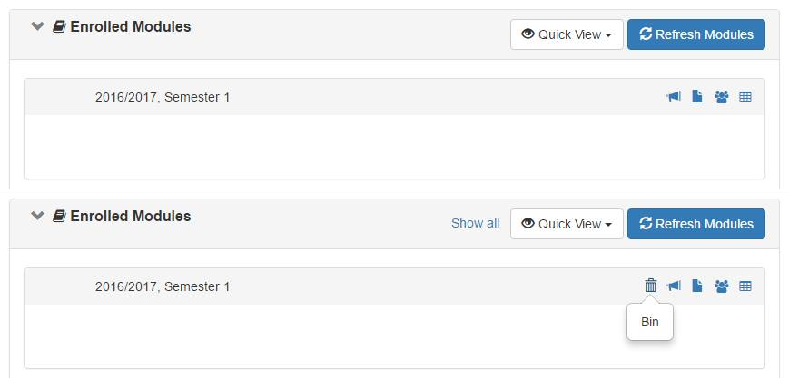

# IVLE Tweaks
This is a Google Chrome Extension for NUS IVLE.

Some maybe useful, some just because. After all, I spend much time on IVLE. See [features](#features).

## Table of Contents
1. [Features](#features)
1. [Requirements](#requirements)
1. [Installation](#installation)
1. [Contributing](#contributing)

## Features
- **Notification Observer**
  - Annoyed by the bright red 0? Hides the notification count when it's 0!

   
   

- **Module Bin**
  - Finished an exam paper? What's an alternative to burning your books to celebrate? How about binning the module on IVLE?

   

## Requirements
- Google Chrome
- Access to [NUS IVLE Workspace](https://ivle.nus.edu.sg/v1/workspace.aspx)

## Installation
- Two-click installation from
[Chrome Web Store](https://chrome.google.com/webstore/detail/ivle-tweaks/jdfihkjjaogjbfdbpgjmmmjaeebcimmk)!

## Contributing
Contributions are welcome! The easiest way to contribute is to post bugs reports and feature requests in the [issue tracker](https://github.com/acjh/ivle-tweaks/issues).
